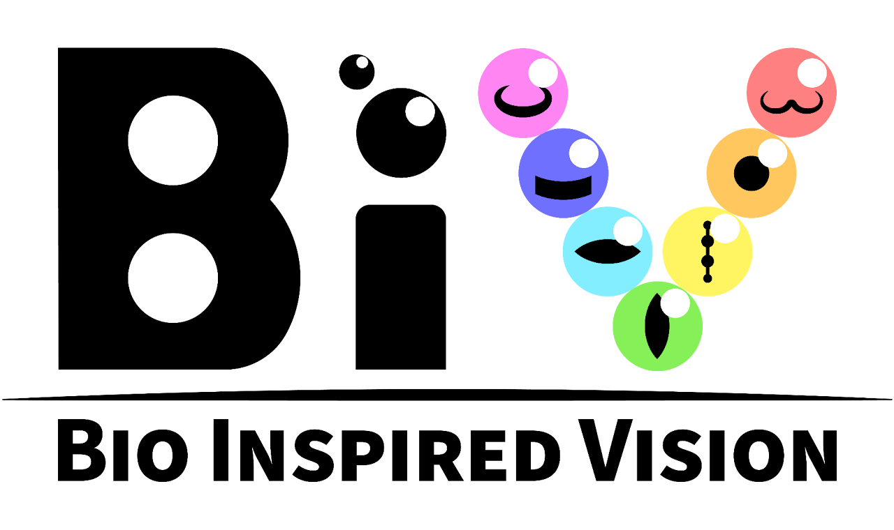

### [Bio Inspired Vision Lab](https://www.alexander.vision/) at Northwestern University

Welcome to the Bio Inspired Vision Lab at Northwestern! We bring together tools from computational photography, animal vision, and information processing to uncover engineering principles for better imaging systems.

